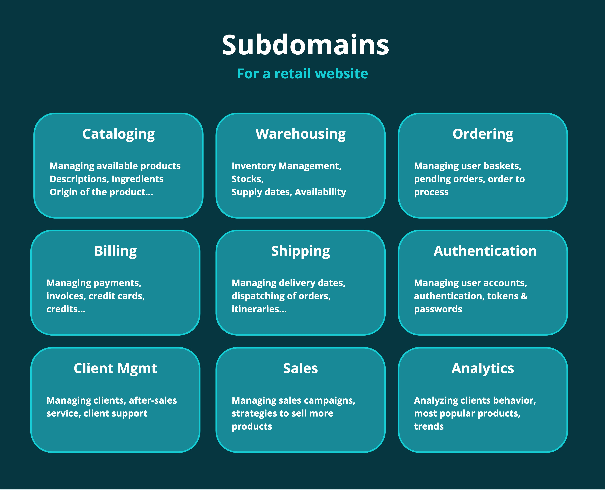
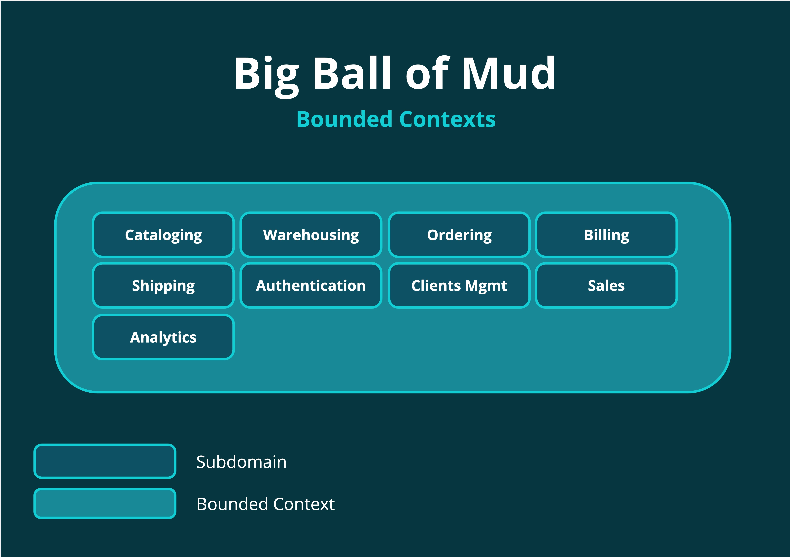
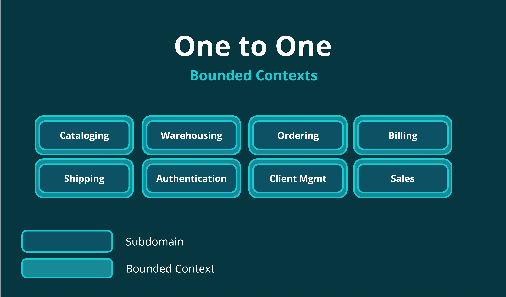
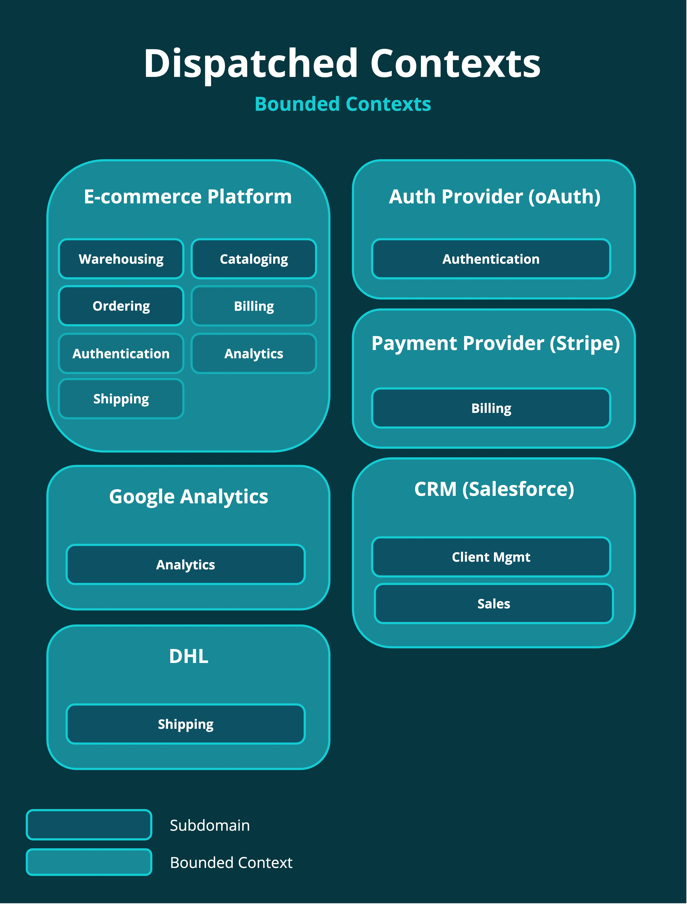
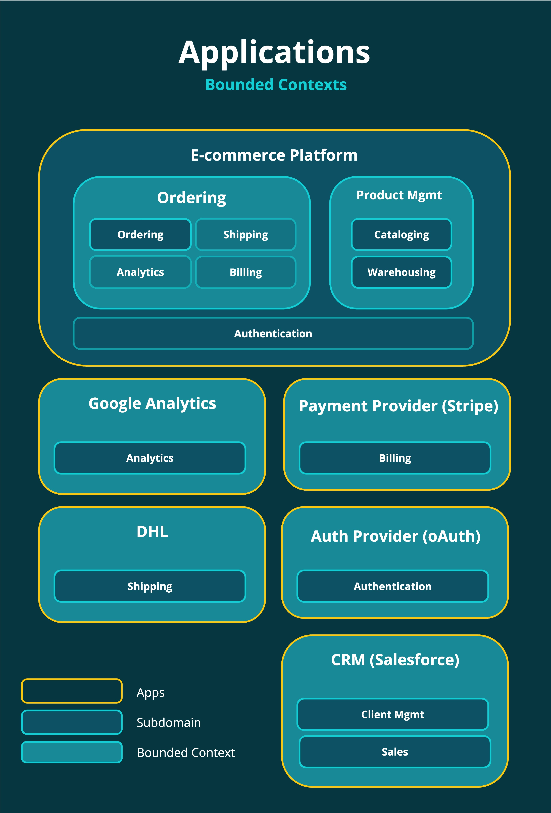

Quand on découvre le Domain-Driven Design, surtout à travers les livres récents, on commence souvent par enseigner
le design stratégique, à savoir identifier le **Domain** et les **Subdomains**, et décomposer son application en **Bounded Contexts**.
 
Seulement, la différence entre les deux est souvent mal compris (peut-être également mal expliquée ?). On parle souvent
d'alignement et de microservices, on aime à penser qu'un Bounded Context est la matérialisation d'un Subdomain.

La réalité est plus riche que ça.

## Problem Space


**Définition** : le **Problem Space** correspond au problème que l'entreprise essaye de résoudre. Il décrit l'état actuel des choses. On analyse
le Problem Space d'une entreprise pour comprendre ce qu'elle fait, pourquoi elle le fait et de quelle façon. On analyse également
les "zones" du Problem Space qui font la différence entre cette entreprise et ses concurrents, **celle qui lui permet de gagner de l'argent.**


Commençons par définir les acteurs de notre pièce !

- **Domain** : c'est "ce que fait votre business". Si vous développez une application de gestion de newsletters à la Mailchimp,
alors votre business est la gestion de newsletters et tout ce que ça regroupe (applicatif, marketing, authentification, comptabilité...)
- **Subdomain** : le domain est souvent trop large pour être étudié dans son ensemble, alors il est plus simple de le décomposer en
sous-domaines. On identifie généralement quelques Core Domains, ceux qui sont le plus importants pour votre business, là où se trouve l'argent,
et on le distingue des autres domains un peu moins importants qu'on appelle Supporting Domains ou Generic Domains.
- **Core Subdomain** : on entend parfois parler de "Core Domain", c'est exactement la même chose. C'est ce que fait votre boîte qui
lui permet de générer de l'argent, ce qui le distingue de ses concurrents, ce qu'il fait de mieux.
- **Supporting Subdomain** : quand on a isolé le core, il reste plusieurs activités très importantes, elles le sont juste un peu
moins que le Core.
- **Generic Subdomain** : le genre de sujet que vous allez gérer de la même façon que vos concurrents. 

Si on prend l'exemple d'Auchan, on peut imaginer que leur avantage compétitif est **leur capacité à vendre des produits moins cher que la concurrence** par exemple.
Pour ce qui est Supporting, la gestion numérisée du catalogue de produit est importante et doit répondre à leur besoins spécifiques.
Enfin, la gestion des employés, la comptabilité, la gestion des stocks, etc, sont des domaines génériques car ils le font de la même façon que les autres.

Faisons une liste des subdomains d'Auchan.

Retenez que cet aspect stratégique concerne le **Problem Space**. On vient simplement
d'analyser la réalité du terrain telle qu'elle existe, **c'est une cartographie de l'existant**. 

## Solution Space

Maintenant que le problème est analysé, il est temps de mettre au point une solution. Et cette solution commence par la
création de **Bounded Contexts**.


Les Subdomains sont **découverts**, ils existent déjà.
Les Bounded Contexts, eux, sont **créés**. 


L'approche la plus simple est de se dire qu'on va développer un seul modèle dans une seule application monolithique avec
un seul langage ubiquitaire. Cette grosse application, qu'on appelle souvent **Big Ball of Mud**, est le seul et unique
Bounded Context de notre business.

Comme on l'a vu dans [Comprendre les Bounded Contexts](/posts/comprendre-les-bounded-contexts), cette approche est terrifiante
car elle implique d'avoir des objets très lourds, complexes et difficile à maintenir, ou bien d'avoir des objets à prefixes,
tel que `AdsUser`, `ShippingUser`, `AccountingUser`, etc.

Or, ce sont des termes qui n'ont pas de sens pour le métier. Le métier parle d'**Utilisateur**, pas de `AdsUser` ou `ShippingUser`.

Le langage est appauvri et ne correspond plus au langage ubiquitaire et le modèle devient nébuleux : il faut introduire des
"traductions" entre ce que disent les experts métiers et ce qu'imaginent les développeurs.

En bref, c'est une catastrophe.

L'autre approche consiste donc à associer un Bounded Context à chaque Subdomain.

Chaque Bounded Context peut se matérialiser... 
- Par un package dans une application monolithique (un JAR, une GEM, un DLL...)
- Par une application indépendante (comme un microservices)

Pour beaucoup, c'est le nirvana. Chaque contexte possède son langage, son modèle, et il n'y a aucun contact entre eux si ce n'est
par envoi de message (asynchrone) ou par appel API (synchrone). Le désavantage, c'est qu'il va falloir être **vigilant dans le design 
de la communication entre les différents contextes**, d'autant plus que certains contextes seront plus importants que d'autres et que
certains groupes de contextes communiqueront beaucoup plus ensemble que d'autres groupes.

Par exemple, il y a de forte chances que **Cataloging** et **Ordering** communiquent beaucoup ensemble pour permettre aux clients de la 
plateforme de **consulter les produits et de les commander**. 

Ce ne sera pas forcément le cas de Authentification et Sales.

De plus, certains Subdomains sont présents dans plusieurs Bounded Contexts. Par exemple, la partie Authentification sera
très présente à la fois dans le Cataloging (pour distinguer qui peut ajouter des produits, les admins par exemple) et dans le Ordering
(pour identifier la personne à l'origine de la commande).

Même si le Subdomain est en grande partie présente dans le Bounded Context du même nom, **ce Subdomain aura aussi une petite présence dans
certains autres contextes**, mais peut-être pas dans tous. On peut s'attendre à ce que la partie Client Management soit gérée dans une application
complètement à part, dans Salesforce par exemple, avec un système d'authentification bien distinct.

En d'autre termes, il ne faut pas nécessairement voir Subdomains & Bounded Context comme une relation 1:1, mais plutôt
comme deux couches superposées : **les Bounded Context qui sont la topographie de la solution et les Subdomains qui sont la topographie
du problème.**

## Séparation intelligente

Deux constats découlent de notre approche précédente :
- certains Subdomains sont présents dans plusieurs Bounded Contexts
- certains Bounded Contexts représenter plusieurs Subdomains

Voilà un exemple.

Ici, chaque Bounded Context est matérialisé par une application, un process distinct.

On voit clairement que le Bounded Context intitulé "E-commerce Platform" recoupe plusieurs Subdomains : 
- **Warehousing**
- **Cataloging**
- **Ordering**

Ces trois Subdomains sont tellement liés qu'on a décidé de les regrouper dans un même Bounded Context.


Dans ce cas là, on se retrouvera certainement avec un overlap. On aura certainement une classe **InventoryProduct** et **CatalogProduct**, ce qui ne
correspond pas tellement au langage métier, et il faudrait les subdiviser en Bounded Contexts distincts car ils ont visiblement leur propre
langage ubiquitaire.

Mais faire cette distinction dans le code (**car c'est de code qu'il s'agit quand on parle de Bounded Context**) n'est pas forcément
facile à faire, alors les regrouper en un seul contexte quitte à légèrement appauvrir le langage ubiquitaire est un trade-off possible.


Mais on voit aussi (avec un fond de couleur plus clair) que les subdomains **Billing**, **Authentication**, **Analytics** et **Shipping** y sont présent.
- Billing car même si on ne gère pas nous même les paiements, on doit pouvoir afficher un formulaire de paiement au client
- Shipping car même si on ne gère pas la logistique, on doit pouvoir planifier une livraison

Ces subdomains ont une présence dans ce Bounded Context même si leur coeur réside dans un autre Bounded Context. C'est d'ailleurs là
qu'interviennent les **Context Maps** qui permettent de visualiser les relations entre les différents Bounded Contexts. Un Bounded Context peut
consommer le modèle d'un autre Bounded Context tel quel, ou bien demander à ce que cet autre BC implémente un Published Language, ou finalement
introduire un Anti-Corruption Layer, voir cumuler un PL + ACL... On en parlera dans un article sur les Contexts Map :)

## Applications

Un Bounded Context peut-être un service distinct, un processus à part vivant dans un serveur distant. C'est le cas lorsqu'on
communique avec un autre Bounded Context via une Web API ou lorsqu'on est sur une architecture en microservices.

On pourrait alors croire qu'un Bounded Context = Une Application, mais ça aussi, c'est faux. 

Un Bounded Context est une délimitation logique et non physique. Comme on l'a dit plus haut, ça peut-être...
- Un simple dossier dans une application monolithique
- Un composant, comme un package en Java, un module Ruby ou un projet en C#
- Un service distant ou un microservice

Ici, on a une application intitulée **E-commerce Platform** qui est un monolithe contenant deux Bounded Contexts : Ordering et Product Management.
Il y a également la présence du Subdomain Authentication qui fera appel à un Bounded Context séparé, Auth0 ou Firebase par exemple. Et chacun
des autres Bounded Context est une application monolithique à part entière (ou pas, on est pas dans leur code ;)).

## Conclusion

**Les Subdomains sont la topographie du problème, les Bounded Contexts sont la topographie de la solution**. Il n'y a pas nécessairement
d'alignement 1 à 1 entre Bounded Context et Subdomains : en pratique, c'est rarement le cas et ça n'est pas forcément souhaitable. 
Il y a un espace où sont représentés les Subdomains, un autre espace où sont représentés les Bounded Context, et on peut les regrouper ensemble
comme on l'entend.

Le dernier schéma est très représentatif de ce qu'il se passe en pratique : on démarre avec un seul gros Bounded Context qui regroupe plusieurs subdomains
et on sous-traite les subdomains moins importants à d'autres services qui sont leur propre Bounded Context avec leur Published Language.

A mesure que l'entreprise grossit, de nouveaux Bounded Contexts peuvent émerger et certains peuvent être **séparés du monolithe** et devenir des services tiers conçus avec **un langage de 
programmation et les outils adaptés**. Un Bounded Context qui gère les contenus vidéos (stockage, compression, transcoding, analyse...) peut vivre dans des Cloud Functions sur AWS et
mobiliser une équipe dédiée par exemple.