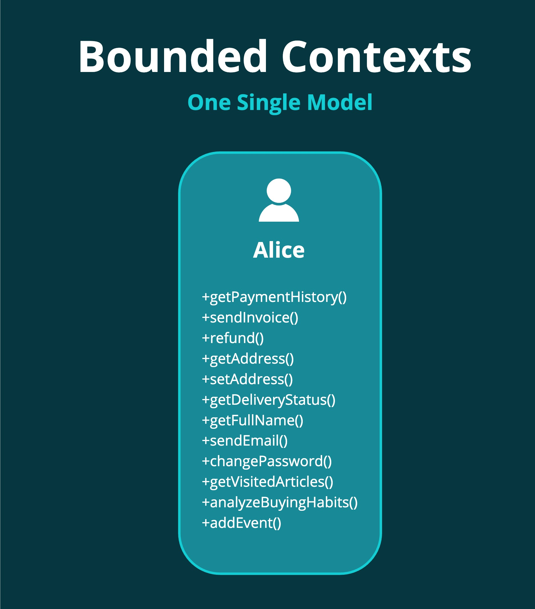

Un bon moyen de saisir la notion de Bounded Context est de se projeter dans la vision orienté-objet qu'on se faisait d'un **Domain Model** à l'époque où l'OO n'était pas encore mature.

Le nirvana du dev OO était la conception **d'un modèle unifié et parfait**. Un joli diagramme qui fait la jonction entre tous les éléments d'un domain sans aucune rature.

Mais sur des systèmes larges et complexes, c'est impossible.

Prenons un exemple : un utilisateur, du point de vue de Auchan.

Auchan, c'est un business sacrément vaste avec beaucoup de zones d'expertise :

- La publicité
- Le marketing
- La gestion de la relation client (CRM)
- La comptabilité et la facturation
- La gestion de commandes en ligne
- La livraison

S'il existe une personne Alice dans le système, **elle aura des caractéristiques différentes selon les différents aspects du business.**

- L'aspect Ads sera intéressé de savoir les pubs qu'elle a vu, ce qu'elle a acheté à la suite de la pub, etc
- L'aspect CRM voudra avoir un historique de ses interactions avec l'entreprise
- La comptabilité aura besoin de connaître l'historique d'achats, les moyens de paiement et devra fournir des factures
- La gestion de commande voudra gérer le cycle de vie d'une commande et préparer la livraison
- La livraison voudra connaître son adresse et avoir des indications spéciales (livraison froide ou non par exemple)

Dans un tel système, un seul modèle Utilisateur aurait..

- Des centaines de relations vers d'autres objets pour chaque zone d'expertise
- Des centaines d'attributs et de méthodes
- Il serait très lourd à charger en RAM.
- Sujet à une énorme contention.
- Difficile à maintenir.

Clairement, un modèle unifié ne convient pas.

On peut découper le modèle Utilisateur selon la signification qu'il a pour certains acteurs.

- **Pour l'aspect Ads**, on ne gère que l'information relative aux pubs
- **Pour l'aspect Shipping**, seulement l'adresse de livraison

Ainsi, on se retrouve avec une même personne (Alice) avec différentes informations selon le besoin.
Chacun de ces aspects étant un Bounded Context, et chaque Bounded Context ayant une définition très spécifique de ce qu'un Utilisateur représente pour lui.

**Différents modèles, mais même personne.**

L'avantage de cette vision est que **l'on peut modifier ces différents aspects d'Alice indépendamment**. 
Quatre équipes de devs s'occupant des différentes applications peuvent travailler en parallèle et déployer leur application
en toute indépendance sans impacter les autres, ce qui est impossible avec un modèle partagé.

Le désavantage, c'est qu'avoir une compréhension complète de ce qu'est Alice dans le système **implique d'intégrer les différents BCs**.

Si vous devez par exemple, RGPD oblige, supprimer les données d'Alice, il faudra repercuter l'opération dans tous les BCs.
Ce qui implique généralement de designer un BC comme étant la source de référence duquel part l'action de supprimer Alice
(le CRM par exemple, si la demande vient du support client, ou bien l'application en elle-même si la demande est réalisable depuis le site web
et d'envoyer un message aux différents Bounded Context sous forme d'évènement ou de commande.

C'est la raison pour laquelle qui dit Bounded Context dit souvent [Message Integrations Patterns](https://www.enterpriseintegrationpatterns.com/patterns/messaging/),
un sujet passionnant dont on reparlera bientôt.