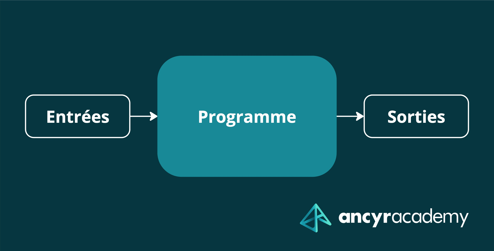

Qu'est-ce que le pattern Ports & Adapters ? Quel intérêt ? Pourquoi s'en servir ? Et surtout, qu'est-ce que ça coûte ?

<!--more-->

## Entrées et Sorties

> Si un arbre tombe mais que personne n'est à proximité pour l'entendre... fait-il du bruit ?

Tout programme qui s'exécute communique avec le monde extérieur à travers ce que l'on appelle des **entrées et sorties**, ou
plus vulgaire **I/O**. Nous autres humains (et parfois autres programmes) envoyons des messages à un programme via une **entrée**, notre clavier par exemple. 
Et celui-ci nous répond via une **sortie**, comme notre écran.

Ces entrées et sorties constituent ce que l'on appelle la **frontière de l'application**. 

**A la frontière d'entrée**, on trouve généralement un morceau de code qui intercepte ce que l'on a tapé au clavier avant de le passer au programme. 
Et pareillement, **à la frontière de sortie**, on trouve du code qui communique avec le monde extérieur sans qu'on ai à se soucier des détails.



Le système d'exploitation **UNIX** est réputé pour son utilisation ingénieuse des entrées/sorties. Premièrement à travers les concepts
**d'entrée standard** et de **sortie standard**, un programme peut fonctionner sans avoir à se soucier d'où vient l'information, ni où elle doit l'envoyer.
C'est ce qui permet d'exploiter le principe de **pipes** avec lequel on peut enchaîner plusieurs programmes les uns à la suite des autres et composer
des comportements à partir de programmes très simples.


Ces notions de frontières sont **extrêmement importantes** pour comprendre tout un pan de l'ingénierie logicielle, surtout en
ce qui concerne les **tests automatisés**.

## Anatomie d'un programme

Comme on le sait, un programme est un morceau de code plus ou moins complexe qui communique avec le monde extérieur via ses
entrées et ses sorties. Du point de vue du programme, une entrée est ce qui entre et donc **provient** de l'extérieur, tandis qu'une sortie
est ce qui sort et donc **va vers** l'extérieur.

Le programme en lui même possède l'un des deux rôles dans ces activités :
- Soit il reçoit une commande via son entrée afin de lui dire quoi faire
- Soit il emet une commande afin de dire à un autre programme quoi faire


Dans un programme court tel qu'un script, il y a généralement qu'une seule entrée et une seule sortie. Mais dans les programmes long comme
les serveurs web, il peut y en avoir beaucoup plus !

**En entrée...**

- Reception d'une requête HTTP
- Ecoute d'un évènement émit par un programme tiers
- Invocation par ligne de commande
- Communication entre threads ou entre process

**Et en sortie...**

- Création d'une requête HTTP
- Communication avec la base de données
- Envoi d'un e-mail
- Emission d'une notification

Il se peut même que la majeure partie de votre application web soit **essentiellement de l'I/O**. A vrai dire, c'est le cas
de la plupart des applications qui n'ont pas beaucoup de complexité algorithmique.

## Au coeur du programme

Prenons un programme simple, par exemple... **un générateur de Questionnaire à Choix Multiples (QCM).**

Voilà le brief.

> On veux développer un programme qui aide l'utilisateur à créer un QCM en lui laissant la possibilité d'entrer des questions et de
> fournir les réponses qui va avec. Il peut ensuite enregistrer ce QCM quelque part pour l'imprimer ou l'envoyer à des amis.

Vous avez vu la façon dont l'intitulé est présenté ? Vous avez remarqué quelque chose d'intéressant ?

**Non ?**

Bon, voyons comment un client lambda pensant bien faire aurait formulé l'intitulé pour ce même programme.

> Je veux un site web dans lequel mes clients peuvent remplir des formulaires pour créer des QCMs. Ils doivent 
> pouvoir ensuite appuyer sur un bouton "terminer", ce qui les redirigera vers une page de téléchargement.

Là, c'est plus clair ? Toujours pas ?

Allez, troisième exemple.

> J'aimerais créer une application mobile dans lequel mes clients peuvent créer un QCM en utilisant la UI
> native à iOS et Android pour que l'application leur soit familière. Ils arrivent alors sur une page de création de QCM,
> et il y a un bouton "Ajouter une question" qui ouvre une modale et puis un autre bouton "Ajouter une réponse" qui en ouvre une autre et...

Alors, qu'est-ce qui varie entre ces descriptions ? **Le contexte**. Tantôt une application web, tantôt une application mobile...

Mais qu'est-ce qui reste inchangé ? 

**La fonctionnalité**.

Il y a une différence de vocabulaire très subtile mais extrêmement importante entre le premier brief et les deux autres : 
**le premier brief ne fait aucune mention des détails.**

**Comment utilise t'on l'application** ? Est-ce via une borne physique, un site web, une tablette ?

**Et où sauvegarde t'on le fichier** ? Sur un système de fichier, dans une base de donnée ?

Ce sont des choses qui varient indépendamment de la fonctionnalité principale de l'application : **permettre à un utilisateur
d'éditer un QCM**.

**Et c'est ça, le coeur de l'application.** C'est la raison d'être de l'application, ce qui la distingue d'une autre, sa plus-value.
C'est ce qui rend l'application spéciale.


On pourrait coder une centaine de variantes de cette application, mais son coeur resterait le même
- Une application web en mode SaaS
- Une application bureau avec un SQLite local
- Une application mobile en 2-tier sur Firebase

Je vais même aller plus loin.

**On pourrait réutiliser exactement le même code pour chacune de ces 3 applications.**

On aurait plus qu'à fournir différentes entrées, selon qu'il s'agisse d'une application web, mobile ou bureau.
Et à fournir différentes sorties, selon qu'on veuille sauvegarder l'information sur Firebase, un SQL ou ailleurs.


Vous l'aurez certainement remarqué, mais les commandes UNIX dont on a parlé plus tôt fonctionnement **exactement sur ce modèle.**
On peut lire un fichier avec `cat`, et le rediriger où on veut : sur la console, sur un serveur tier, dans le presse-papier... Et ce, sans 
modifier le code source de `cat` ! 

On peut étendre `cat` à vie **sans jamais avoir besoin de le recompiler ni de le redéployer.** 

C'est la base de tout systèmes de **plugins**.


## Un exemple concret

Bien qu'on puisse concevoir ses programmes comme étant composé d'un noyau dur et de morceaux de code gérant les entrées et les sorties,
il s'avère qu'en pratique, **la vaste majorité des programmes écrits ne sont pas conçu sur cette idée.**

Ces programmes sont irrémédiablement liés à une entrée spécifique et à une sortie spécifique.
Voilà un exemple.

```ts 
import Fastify from 'fastify';
import { v4 } from 'uuid';
import z from 'zod';
import mysql from 'mysql';

const fastify = Fastify({ logger: true });

const createAccountSchema = z.object({
  emailAddress: z.string().email(),
  password: z.string().min(8),
});

fastify.post('/account', async (request: any, reply) => {
  const data = createAccountSchema.parse(request.body);
  
  const connection = mysql.createConnection({
    host: "localhost",
    user: "user",
    password: "password"
  });
  
  await connection.connect();
  
  const userInDb = connection.query(
    "SELECT * FROM users WHERE emailAddress = ?", [data.emailAddress]
  );

  if (userInDb.length !== 0) {
    return reply.code(400).send({
      error: 'ACCOUNT_ALREADY_EXISTS',
      message: 'An account with this email address already exists',
    });
  }

  const account = {
    id: v4(),
    emailAddress: data.emailAddress,
    password: data.password,
  };
  
  await connection.query(
    "INSERT INTO users VALUES", 
    [account.id, account.emailAddress, account.password]
  );

  database.insert(account);
  reply.code(200).send(account);
  
  await connection.quit();
});

startServer(fastify);
```

Ce code vous est familier ? J'en ai vu des bien pire lors de mes premières années de développement.

Alors, qu'est-ce qui ne va pas ?

- **La logique de la fonction est difficile à distinguer**, la fonction n'est d'ailleurs même pas nommée
- **Le code mêle logique bas niveau** (insertion dans une base de donnée, manipulation SQL) à de **la logique haut niveau** (création d'un utilisateur), ce qui nous fait naviguer entre
concepts techniques et concepts métiers
- **Le code est irrémédiablement lié à une base de donnée MySQL**. Si on doit un jour changer de base de donnée ou faire un upgrade, c'est la moitié du code qu'il faut ré-écrire.
- **Ce code n'est pas testable facilement**. Il faudrait lancer un serveur fastify et une base de donnée pour pouvoir le faire. Or, ça rend le test beaucoup plus fragile et plus lent.

La bonne nouvelle, c'est qu'on peut régler l'ensemble de ces points en très peu de code.

```ts
import Fastify from 'fastify';
import { v4 } from 'uuid';
import z from 'zod';
import mysql from 'mysql';
import SqlAccountRepository from './sql-account-repository.ts'

const fastify = Fastify({ logger: true });

const createAccountSchema = z.object({
  emailAddress: z.string().email(),
  password: z.string().min(8),
});

interface ForManagingAccounts {
  exists(emailAddress: boolean);
  save(account: Account);
}

class AccountCreator {
  constructor(
    private accountRepository: ForManagingAccounts
  ) {}
  
  async create(data) {
    if (this.accountRepository.exists(data.emailAddress)) {
      throw new Error("E-mail address is unavaiable")
    }

    const account = {
      id: v4(),
      emailAddress: data.emailAddress,
      password: data.password,
    };
    
    await this.accountRepository.save(account);
    
    return account;
  }
}

fastify.post('/account', async (request: any, reply) => {
  const accountCreator = new AccountCreator(new SqlAccountRepository());
  try {
    const account = await accountCreator.create(
      createAccountSchema(request.body)
    );
    
    reply.code(200).send(account);
  } catch (e) {
    return reply.code(400).send({
      error: 'ACCOUNT_ALREADY_EXISTS',
      message: 'An account with this email address already exists',
    });
  }
});

startServer(fastify);
```

Voyez comment on a séparé deux parties bien distinctes du code ?
- Celle qui s'occupe de communiquer avec le monde extérieur, qu'il s'agisse des entrées et sorties
- Et celle qui s'occupe du monde intérieur

Le code qui s'occupe du monde extérieur se résume à ça.

```ts
fastify.post('/account', async (request: any, reply) => {
  const accountCreator = new AccountCreator(new SqlAccountRepository());
  try {
    const account = await accountCreator.create(
      createAccountSchema(request.body)
    );

    reply.code(200).send(account);
  } catch (e) {
    return reply.code(400).send({
      error: 'ACCOUNT_ALREADY_EXISTS',
      message: 'An account with this email address already exists',
    });
  }
});
```

On y retrouve ce que l'on appelle du **code d'infrastructure**, dans le sens où c'est du code purement technique qui
s'occupe des frontières. Il n'est d'aucun intérêt pour le client. Il n'y a aucune logique métier à l'intérieur, juste de l'orchestration.

De l'autre côté, le code qui s'occupe du monde intérieur ressemble à ça.

```ts
interface ForManagingAccounts {
  exists(emailAddress: boolean);
  save(account: Account);
}

class AccountCreator {
  constructor(
    private accountRepository: ForManagingAccounts
  ) {}
  
  async create(data) {
    if (this.accountRepository.exists(data.emailAddress)) {
      throw new Error("E-mail address is unavaiable")
    }

    const account = {
      id: v4(),
      emailAddress: data.emailAddress,
      password: data.password,
    };
    
    await this.accountRepository.save(account);
    
    return account;
  }
}
```

Il y a plusieurs points extrêmement intéressants dans ce code.

**Premièrement**, il s'agit d'un code très haut niveau, facile à comprendre et à manipuler. Il n'y a pas de bruit autour du code.
Il se contente de vérifier l'existence d'un compte et d'en créer un si l'adresse e-mail est disponible. Cette logique là était
beaucoup plus difficile à discerner dans la première version du code.

**Deuxièmement**, il est beaucoup plus intéressant sur le plan du **design**. Ici, on distingue une **responsabilité** : celle
de gérer le stockage des comptes. Cette responsabilité vit derrière une **interface** car il y a plusieurs façons possible de gérer ce stockage :
via une base de données SQL, via Firebase, via le système de fichier, ou même en RAM pour prototyper. Du point de vue de `AccountCreator`, ça ne change strictement rien.
Sa logique de haut niveau reste la même : vérifier la disponibilité de l'adresse e-mail, puis sauvegarder le compte.

Du point de vue de `AccountCreator`, cela n'a aucune importance. A vrai dire, on pourrait passer de MySQL à MongoDB 
**sans avoir le moindre impact sur `AccountCreator`**. On dit que **la logique métier est orthogonale à la logique infrastructurelle**.
C'est-à-dire que les deux peuvent **évoluer indépendamment l'un de l'autre**.

C'est là l'un des points critiques les plus important du **design orienté objet** : raisonner en termes de rôles et de collaborateurs.
On a donc créé un rôle artificiel qui est celui de gérer le stockage des comptes, et il s'avère que ce rôle se situe **à une frontière** : 
c'est le dernier morceau de code qui est invoqué avant de communiquer avec une base de données (ou toute autre implémentation).

Et le rôle est bien nommé : `ForManagingAccounts`.


Si vous êtes déjà familier de l'écosystème **Clean Architecture**, vous auriez certainement appelé cette interface 
`AccountRepository`. C'est une nomenclature extrêmement populaire parmi les devs, et je l'utilise moi-même.

Pour ce qui est du pattern **Ports & Adapters**, que l'on mélange souvent avec la **Clean Architecture** et les **Onion Architecture**, l'idée
est la même, mais on aime bien nommer nos interfaces vis à vis de **ce qu'elles font** et non pas de **ce qu'elles sont**.

On va prendre un nom qui répond à la question : **à quoi ça sert ?**. Ici, en l'occurence, on a besoin d'un "truc" qui **sert à gérer des comptes**.
D'où le nom, `ForManagingAccounts`.

**La nomenclature importe peu dans le pattern Ports & Adapters,** ce qui importe le plus c'est... vous n'avez qu'à lire la suite !



## Le Pattern Ports & Adapters

Ce que vous venez de voir, c'est le pattern **Ports & Adapters** en action. Pattern que l'on appelle souvent **Architecture Hexagonale** ou 
encore **Clean Architecture**... 


On retrouve souvent les termes **Ports & Adapters** mélangés à **Onion Architecture** ou **Clean Architecture**. Il y a quelques subtiles
différences dans la définition de ces termes, mais ils ne sont pas très utiles à la discussion. Notez simplement que **Ports & Adapters** est 
le pattern dans sa version la plus pure.


En quoi consiste ce pattern ? **Je le résume.**

- Certaines parties du code font parties des **frontières**, qu'il s'agisse des entrées ou des sorties
- Ces parties là servent à **faire entrer et sortir** de l'information de l'application
- Le coeur de l'application n'a pas forcément besoin d'avoir connaissance de la façon dont l'information entre et sort
- On peut donc insérer des "**douanes**" à ces frontières et isoler le coeur de l'application du monde extérieur
- Ces douanes portent le nom de **ports** et **adapters**
- Un **port** est simplement une interface qui représente une responsabilité, comme `ForManagingAccounts`
- Un **adapter** est une implémentation de cette interface, ici `SqlAccountRepository`, mais ça aurait pu être `FirebaseAccountRepository` ou `MongoAccountRepository`
- Et le coeur de l'application **ne communique vers l'extérieur qu'à travers ces ports** (le coeur ici étant `AccountCreator`, un service comme un autre)
- On peut ainsi faire **évoluer le coeur de l'application indépendamment de l'I/O**
- Et on peut faire **évoluer l'I/O indépendamment du coeur de l'application**

## Quels avantages ?

Cette façon de programmer est mon approche par défaut, car ses avantages sont monstrueux.

- **Testabilité du code** : la logique métier est entièrement [testable unitairement](https://courses.ancyracademy.fr/p/essentials-tests-unitaires), totalement parallélisable pour de hautes performances, et sans avoir besoin d'initialiser une base de données ni un serveur web.
- **TDD** : le code métier [peut-être développé en TDD](https://ancyracademy.fr/test-driven-development), en guidant le développement par les tests, et ce avec un feedback instantané
- **Séparation des responsabilité** : le code gérant l'infrastructure est dissocié du code métier, le code est beaucoup plus simple à maintenir car mieux organisé
- **Replaçabilité** : on peut remplacer une technologie par une autre, par exemple changer d'ORM ou de base de données, sans impacter la totalité du code


## Et les inconvénients ?

Comme toute chose en informatique, ce qui apporte son lot d'avantages apporte également son lot d'inconvénients. 
En l'occurence, le pattern Ports & Adapters en a vraiment très peu.

- **Plus de code boilerplate** : faire du Ports & Adapters implique nécessairement d'écrire un peu plus de code, surtout dans les langages statiques
- **Courbe d'apprentissage** : se former au pattern prend du temps car c'est une façon de travailler qui n'est pas suffisamment enseigné


--- 

## Aller plus loin

Je ne vous ai montré que l'aspect immergé de l'iceberg qu'est le pattern Ports & Adapters. Mais ce principe étonnament simple aboutit 
à énormément de conséquences sur la façon dont on développe nos applications.

Je présente ce pattern plus en profondeur dans mes [formations Clean Architecture](https://clean-architecture.ancyracademy.fr).